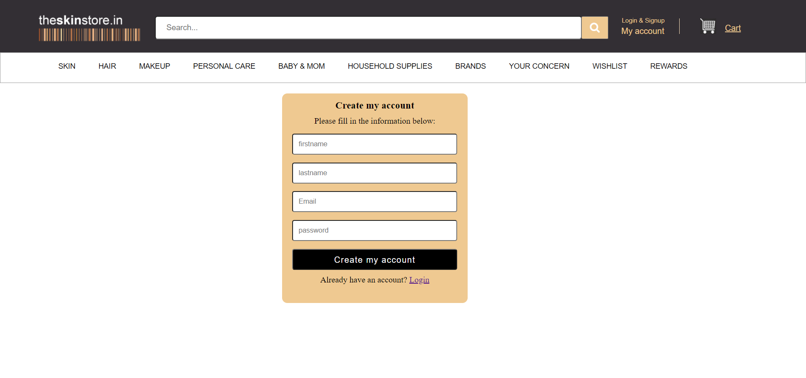

# Theskinstore - Clone

## Project : Clone of https://theskinstore.in/

## What is Purplle?

As you might have seen https://theskinstore.in/, It is an online portal with a very large collection of cosmetics, skincare, hair care, Baby care, Home Supplies & fragrances. It showcases some of the best products from the leading brands in the world at the best price.

In this project I have tried to make a clone of https://theskinstore.in/ website with my efforts and the technology stack which I learnt till now in masai school.

# Technology Stack Used

In this project I have used the following tech stack.

- HTML
- CSS
- JAVASCRIPT
- EXPRESS
- NODEJS
- MONGODB - Atlas

To make this clone I have used HTMl, CSS and JavaScript for front-end and NodeJS, ExpressJs and MongoDB for back-end.

# Libraries Used

All the images, icons, and links have taken from the original website (https://theskinstore.in/)

# Snapshots of My Project 📸

## Landing Page

This is the landing page of the website. You can see and choose all latest and trending top products from here.

## SignUp Page

You can signup with the website from here .

## Login Page

You can login to the website from here by entering required details.

## Navigation Bar

Here, you can choose a category of products whatever you want.

## Products Page

Here, you can see all the products and whenever you are on any product you will see ADD TO CART option, by clicking the button you can add the products to cart.

## Cart Page

Here, you can see all of your products which are added into cart, you can avail the discount by applyling the promocode in respective field and you can remove any product from here also.

## Address Page & Payment Page

In this page you can add your address to where your product should be delivered, also You can see lot of payment options here and you can choose any one of them to pay for your product.

## Thankyou Page

Finally, Here you can see the order confirmed message and by clicking "Go to Homepage" you will be redirected to home page and you can continue the shopping.

# Limitations

The pages are not responsive yet , those pages are might not be properly visible on small screen devices.

# End Notes

In this project I have tried to a perfect clone of the original website as much as possible with very limited knowledge of front-end & back-end.

This entire journey of making the project was awesome. I learned lots of things by applying to the real website and it gave us a lot of confidence.

# Team Members 🤝🏻

### I have done this project alone within 3 days, here I am providing my github profile link:

1. Prashanth Dyavanapally

   GitHub: (https://github.com/Prashanth2856/)
